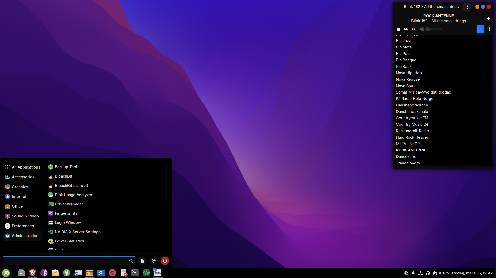

# Linux Mint Guides

A collection of personal installation and configuration guides for **Linux Mint**, **LMDE**, and related distros focused on encrypted root (LUKS), Btrfs filesystems, secure setups, and system configuration.

> Warning: Some guides involve **wiping drives entirely**. Always back up your data before following any installation guide.

## Preview

*A clean Linux Mint Cinnamon setup — dark theme, minimal taskbar, Goodvibes playing in the background.*
---

## Guides

### [Linux Mint & Ubuntu Derivatives - Btrfs Root + LUKS2](guides/linuxmint-btrfs-root-luks2/)

Install **Linux Mint** or other Ubuntu-based derivatives with LUKS2 encrypted root on a Btrfs filesystem.

- UEFI + GPT partitioning with `parted`
- LUKS2 with Argon2id key derivation
- Btrfs with `@` and `@home` subvolumes
- zram swap (no swap partition)
- Timeshift snapshots + grml-rescueboot for recovery

---

### [Linux Mint & Ubuntu Derivatives - Btrfs Root + LUKS2 (BIOS)](guides/linuxmint-btrfs-root-luks2-bios/)

Same as above but for **BIOS/GPT** systems instead of UEFI.

- BIOS + GPT with 1 MiB BIOS boot partition
- LUKS2 with Argon2id key derivation
- Btrfs with `@` and `@home` subvolumes
- zram swap, Timeshift + grml-rescueboot

---

### [LMDE + LUKS + Btrfs + Subvolumes](guides/lmde-btrfs-luks/)

Install **Linux Mint Debian Edition (LMDE)** with encrypted root (LUKS) and a Btrfs filesystem using separate `@` and `@home` subvolumes.

- UEFI + GPT partitioning with `gdisk`
- LUKS container + Btrfs on top
- Notes for older MacBooks (`intel_iommu=off`)
- grml-rescueboot integration (bootable ISO in GRUB)

---

### [Ubuntu & Derivatives - Auto-unlock Secondary LUKS Drive at Boot](guides/unlock-secondary-harddrive-luks/)

Set up automatic unlocking of a **secondary LUKS-encrypted hard drive** at boot on Ubuntu, Linux Mint, and other Ubuntu-based derivatives, using `/etc/crypttab` and a keyfile.

- Works with both ext4 and btrfs filesystems on the secondary drive
- Keyfile stored on the encrypted root — unlocks automatically after main drive is decrypted

---

### [Ubuntu & Derivatives - Post-Install Guide](guides/post-install/)

Everything to do right after a fresh Ubuntu, Linux Mint, or Ubuntu-based install.

- Kernel hardening and system tuning via `sysctl`
- Swappiness tuning for better desktop responsiveness
- Cloudflare DNS over TLS with `systemd-resolved`
- Random MAC address at every boot via NetworkManager
- UFW firewall setup (including QEMU/Virt-Manager support)
- Disable unnecessary services (CUPS, Bluetooth, OpenVPN, ModemManager, kerneloops, casper-md5check)
- Remove unwanted packages (warpinator, Samba, Rhythmbox, Hypnotix, and more)
- Recommended software (Brave, KeePassXC, Goodvibes, Liferea, Tor Browser, Virt-Manager, and more)
- KVM group setup and Windows 10 VM XML reference with detailed explanations
- Zsh configuration — default shell setup, fast-syntax-highlighting plugin, full `.zshrc` with coloured prompt, history, completion, aliases, and rsync backup commands
- Cinnamon desktop tweaks (Linux Mint)
- Font configuration — rendering quality, metric-compatible MS font substitutions, and recommended system fonts
- LibreOffice font setup for maximum MS Office document compatibility

---

### [Encrypted USB Backup Drive Setup (LUKS2 + ext4)](guides/Encrypt-USB/)

Format a USB drive with strong LUKS2 encryption using Argon2id — consistent with a hardened Linux system drive setup.

- LUKS2 with Argon2id KDF (`--iter-time 4000`)
- ext4 filesystem inside the encrypted container
- Drive labelling and permission fixes for rsync/file managers
- Everyday mount/unmount workflow with GNOME Files

---

### [Flat Remix GTK Theme — Cinnamon Patch](guides/gtk-theme/)

A patched version of the [Flat Remix GTK theme](https://www.gnome-look.org/p/1214931/) customised for **Linux Mint Cinnamon** — Blue highlights, Darkest Solid (AMOLED pitch black).

- Fixes unstyled and broken dialogs introduced in newer Cinnamon versions
- GTK4 app coverage via `~/.config/gtk-4.0` symlink
- Flatpak support
- Pairs with Papirus Dark or the matching Flat Remix icon theme

---

## About

These are personal reference guides collected while setting up and configuring Linux systems. Shared in case they help others doing similar work.
